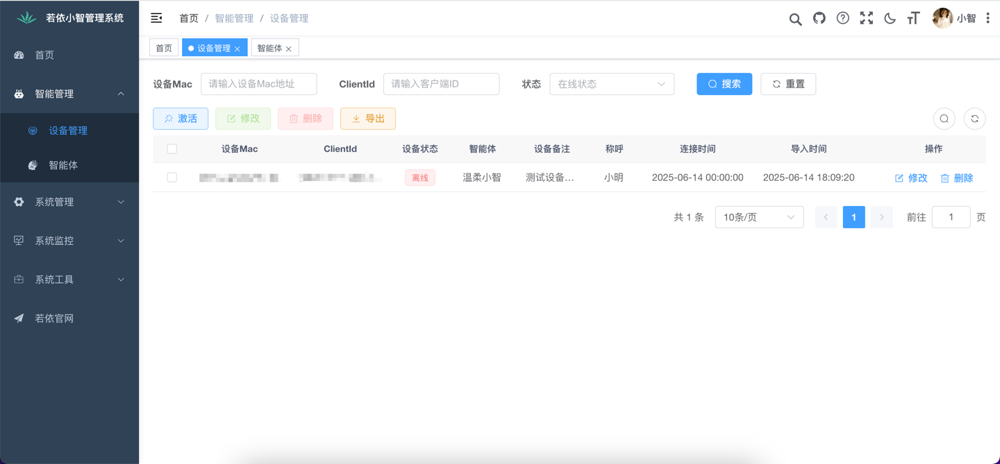

<h1 align="center">基于若依管理系统的xiaozhi-esp32服务端</h1>

本项目为开源智能硬件项目
<a href="https://github.com/78/xiaozhi-esp32" target="_blank">xiaozhi-esp32</a>提供后端服务 
根据<a href="https://github.com/78/xiaozhi-esp32/blob/main/docs/websocket.md" target="_blank">小智WebSocket通信协议</a>使用RuoYi-Vue、Spring AI、轻量级Java-WebSocket、ffmpeg实现 
帮助您快速搭建小智服务器

<a href="https://github.com/dbcjl/RuoYi-xiaozhi/issues" target="_blank">反馈问题</a>
· <a href="./README.md#部署文档" target="_blank">部署文档</a>
· <a href="https://github.com/dbcjl/RuoYi-xiaozhi/releases" target="_blank">更新日志</a>

  
  
  
  
  
  

---

## 一、系统要求

- 操作系统：Linux / macOS / Windows
- Java 版本：**Java 21**
- Maven 版本：建议使用 **Apache Maven 3.8+**
- Node.js（仅用于前端模块编译）：**Node.js 16+**

> 备注：本项目基于 **Java 21** 开发，主要为了使用 **虚拟线程（Virtual Threads）** 提升聊天服务的并发处理能力。相比传统线程，虚拟线程更轻量，可支持大量并发 WebSocket 连接，显著提高系统吞吐量和响应性能。

## 二、项目技术栈

- **后端框架**：RuoYi-Vue 后端子项目（Spring Boot）
- **通信协议**：<a href="https://github.com/78/xiaozhi-esp32/blob/main/docs/websocket.md" target="_blank">小智 WebSocket 通信协议</a>
- **WebSocket 库**：Java-WebSocket（轻量级嵌入式服务）
- **AI 接口**：Spring AI（OpenAI / 百度 / 阿里等大模型接入）
- **音视频处理**：JavaCV-FFmpeg（音频编码、格式转换等）

> 备注：WebSocket 服务采用 **轻量级 Java-WebSocket 实现**，**不依赖 Tomcat 或 Servlet 容器**，启动更快、运行更轻量。

## 三、语音能力支持列表

### 🎙️ VAD（Voice Activity Detection）声音活动检测

| 名称         | 是否免费 | 是否本地 | 是否支持流式 | 备注说明                                       |
|--------------|----------|----------|----------------|------------------------------------------------|
| Silero VAD   | ✅ 是     | ✅ 是     | ✅ 支持        | 基于神经网络模型，轻量准确，适合边缘端使用      |

> ⚙️ Silero VAD v5 版本已集成并优化，适配低延迟处理场景。

---

### 🗣️ ASR（Automatic Speech Recognition）语音识别

| 名称         | 是否免费 | 是否支持流式 | 备注说明                 |
|--------------|----------|--------|--------------------------|
| SenseVoice   | ✅ 免费  | ❌ 不支持  | 本地化私有部署，适配 ESP32 上传音频 |

> 备注：未来可扩展 Whisper、AliASR、百度 ASR 等大模型方案，支持多语种和更复杂环境下的识别。

---

### 🔊 TTS（Text To Speech）语音合成

| 名称             | 是否免费 | 是否支持流式 | 备注说明                                |
|------------------|----------|----------------|-----------------------------------------|
| EdgeTTS          | ✅ 免费  | ✅ 支持        | 微软 Edge 浏览器接口，支持多语种、多角色 |
| 火山引擎 TTS     | ❌ 收费  | ✅ 双流式支持 | 支持音频 + index 双流同步，音色丰富、响应快 |

## 四、项目部署